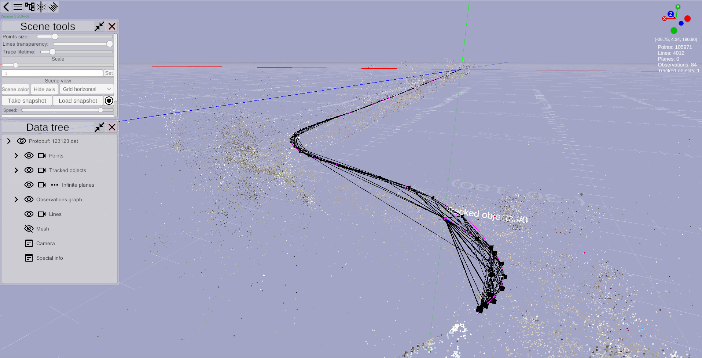

# Elektronik Tools
The tool for testing and debugging SLAM.

Elektronik is a tool that is actively used by the Dioram development team in developing tracking algorithms and SLAM.
This software allows you to visually track:
- changes in the point cloud; 
- changes in the connectivity graph of observations;
- changes in a map constructed using the SLAM algorithm;
- motion of tracked objects (for example, the track of a VR helmet and the reference track);
- detected planes;
- images from camera at the moment of time.

This greatly simplifies the process of debugging the map construction mode, relocalization mode, 
and many other things related to tracking algorithms and SLAM.

There are two main modes available in Elektronik - realtime mode and reading from a file mode.

In the [realtime mode](docs/Usage-EN.md#Online) you can observe the process of building a map whilst the algorithm is running/

The [offline mode](docs/Usage-EN.md#Offline) works by reading data from a file filled with protobuf packages.
It allows you to write all events once and run them without running the main algorithm. 
This mode supports greater displaying opportunities than online mode, because the offline mode has lower performance requirements. 
This mode provides you such features as rewinding events, viewing information about points and observations, “playing” events, etc. 
You can see the detailed overview of all features in the corresponding [docs](docs/Home-EN.md) [section](docs/Usage-EN.md#Offline).

In addition to the main modes, there is also an additional [VR mode](docs/Usage-EN.md#vr-mode). 
This mode allows you to follow all process from a VR helmet, for example, you can walk inside the point cloud built. 
In the VR mode, it is possible to disable tracking of the helmet, connected to your PC. 
This allows you to use your own tracking to move around the scene. 
For example, you can connect a Microsoft Mixed Reality helmet but use your own tracking instead of that provided 
via the installed helmet driver.

At this moment Elektronik supports these sources of tracking data:
- [Protobuf](docs/Protobuf-EN.md). Format developed by Dioram based on 
  [google protocol buffers](https://developers.google.com/protocol-buffers/?hl=en).
  Actively used by dioram developers for everyday work.
- [ROS](docs/ROS-EN.md) Data transmitted by ROS network. Supports ROS, ROS2, rosbag, rosbag2.
  More about possibilities and limitations you can read at [documentation](docs/ROS-EN.md).

If you want to add, improve or accelerate Elektronik, you can find all necessary information 
in [docs](docs/Home-EN.md) along with a description of the source code structure.
Also you can extent Elektronik by writing your own plugins. But for now we are support only
plugins for new types of data sources (protocols). All useful information can be found [here](docs/Plugins-EN.md) in docs.

We are trying to make the Elektronik code as convenient 
as possible for debugging and supporting, so we actively use OOP techniques and patterns.

We hope that Elektronik will help you in developing the SLAM of your dream and will be grateful for your help in its development!

Sincerely, Dioram development team.

