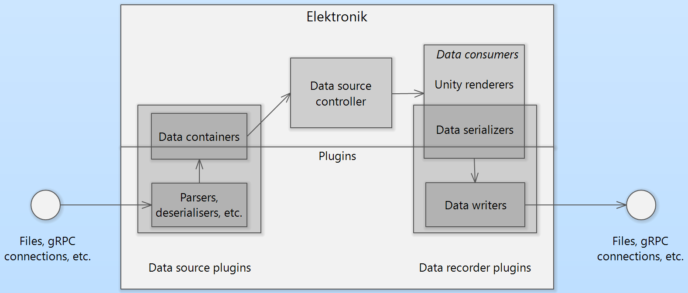
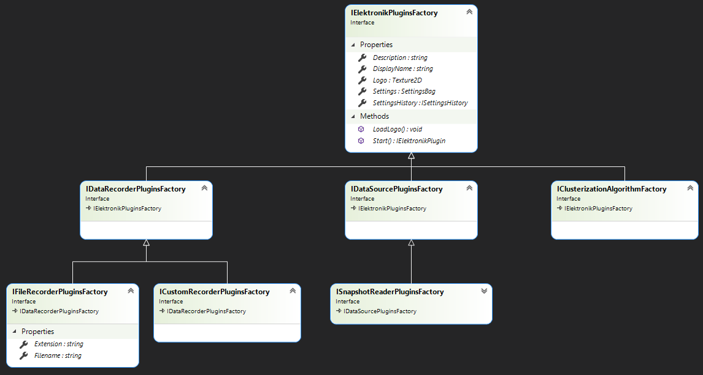
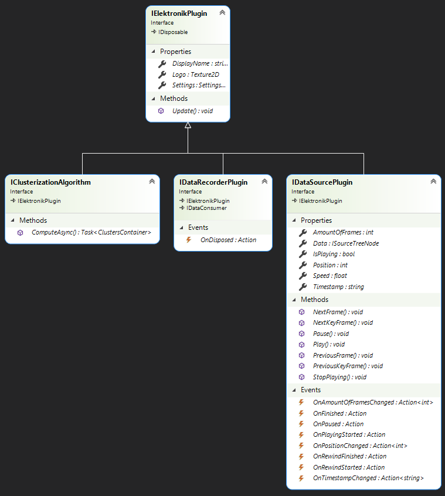
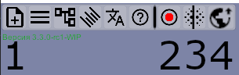
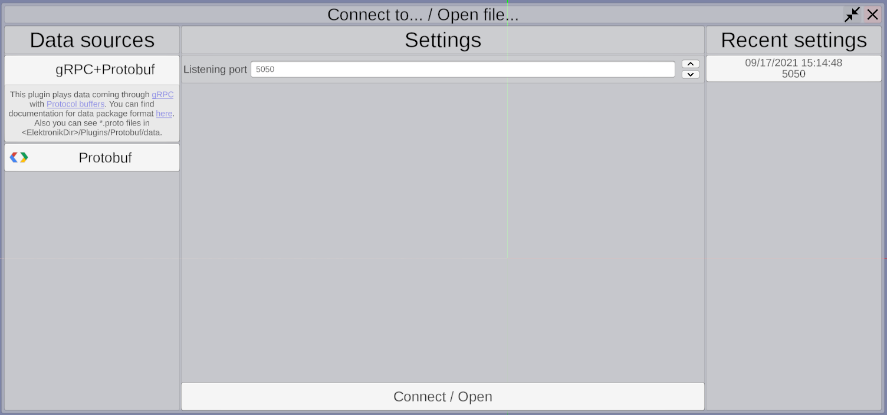
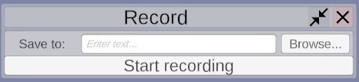
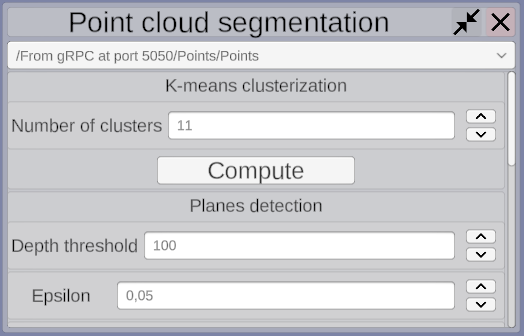
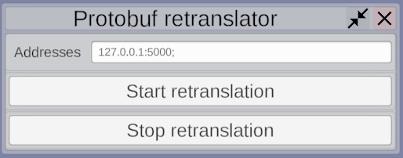
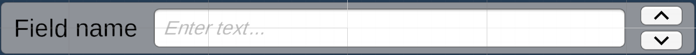

# Plugins for Elektronik

One of main features of Elektronik is extendability using plugins.
All work with data transport protocols, reading from files etc. is doing by external plugins.
Elektronik itself only renders data and connects plugins to each other.
Elektronik is shipped with two plugins for processing incoming data: [Protobuf](Protobuf-EN.md),
[ROS](ROS-EN.md). You may use it as reference for developing your own plugins.

In general Elektronik works with plugins this way:
- Data source plugins create tree of data sources and fill it with data.
- Elektronik subscribes data consumers to updates of data sources.
- Data consumers can render data on screen, or write it to file, or do something else.

## Structure of plugins

Elektronik uses pattern abstract factory for working with plugins.
Each plugins should implement factory class that implements 
[IElektronikPluginsFactory](../Assets/Scripts/PluginsSystem/Factories/IElektronikPluginsFactory.cs) implements,
this class creates and initialises plugin.
Plugin itself must implement [IElektronikPlugin](../Assets/Scripts/PluginsSystem/Plugins/IElektronikPlugin.cs) interface.

Plugins can be divided on three categories (there will be more of them in future),
each of them has its own interfaces of factories and plugins:
- Data sources. You may think of them as model in MVC or MVP pattern.
    - Factories:
        - [IDataSourcePluginsFactory](../Assets/Scripts/PluginsSystem/Factories/IDataSourcePluginsFactory.cs)
          Interface for any data source plugin factories.
        - [ISnapshotReaderPluginFactory](../Assets/Scripts/PluginsSystem/Factories/IDataSourcePluginsFactory.cs)
          inherits `IDataSourcedPluginsFactory`. Marks that plugin can be used for reading snapshots saved to file.
    - Plugins:
        - [IDataSourcePlugin](../Assets/Scripts/PluginsSystem/Plugins/IDataSourcePlugin.cs) Interface for any data source plugin.
        - [IRewindableDataSource](../Assets/Scripts/PluginsSystem/Plugins/IRewindableDataSource.cs)
          Interface for any data source plugin supporting rewind.
- Data recorders. Consumes data from sources.
    - Factories:
        - [ICustomRecorderPluginsFactory](../Assets/Scripts/PluginsSystem/Factories/IDataRecorderPluginsFactory.cs)
          Interface for any data consumer plugin factories.
        - [IFileRecorderPluginsFactory](../Assets/Scripts/PluginsSystem/Factories/IDataRecorderPluginsFactory.cs)
          Interface for data consumer plugins factorys that writes data to file.
          It used to group this type of plugins in UI. See [UI](#UI).
    - Plugins:
        - [IDataRecorderPlugin](../Assets/Scripts/PluginsSystem/Plugins/IDataRecorderPlugin.cs) Interface for any data consumer plugin.
- Algorithms for clustering points cloud. Consumes list of points, returns list of lists of points clustered by implemented algorithm.
    - Factory: [IClusteringAlgorithmFactory](../Assets/Scripts/PluginsSystem/Factories/IClusteringAlgorithmFactory.cs)
    - Plugin: [IClusteringAlgorithm](../Assets/Scripts/PluginsSystem/Plugins/IClusteringAlgorithm.cs)

Plugins can implement special type for their settings. This types mast be inherited from [SettingsBag](../Assets/Scripts/Settings/SettingsBag.cs),
and for them will be generated UI, that will allow user to control plugins settings. See [UI](#UI), [Settings](#Settings).

## UI

From UI's point of view plugins could be divided on two groups:
- plugins that have UI implemented in Elektronik's side.
  - **Data sources** (1). This plugins have special window where user can chose source, set settings (or use recent), start playing.
  There can be only one playing source in time, so before start of new one, old one will be stopped and disposed.

  

  - **Data recorders to file** (2). This plugins have special window where user can chose filename of saved file.
    Plugin will be chosen by file extension.

  

  - ** Clustering algorithm ** (3).

  
- plugins with custom UI.
  - Elektronik creates button on toolbar for all other plugins. This button opens window with generated fields for plugins settings.
  - Example: **Plugin for transmitting scene state via gRPC** (4)

    

Logo for plugins should be in `<Elektronik_DIR>/Plugins/<Plugin_Name>/data/<IElektronikPluginsFactory.DisplayName>_Logo.png`,
if that file not found toolbar button will show plugin's name instead of logo.

## Settings

Each plugin and its factory can have settings, that can be changed by user.
This settings should be class inherited from [SettingsBag](../Assets/Scripts/Settings/SettingsBag.cs).
UI fields will be generated for all public fields with supported types that don't have attribute
[\[Hide\]](../Assets/Scripts/Settings/HideAttribute.cs).
Field name in UI will be get from field name from code using [Humanizer](https://github.com/Humanizr/Humanizer).
Also you can add `[Tooltip("text")]` attribute to show user additional information,
Supported field types:
- `bool`

  

- `int`, `float`

- 

- `int`, `float` with attribute `[Range(minValue, maxValue)]`

- 

- `string`

- 

- `string` with attribute [\[Path\]](../Assets/Scripts/Settings/PathAttribute.cs)

- 

- `Vector3`

- 

- `Action`

- 

[SettingsBag](../Assets/Scripts/Settings/SettingsBag.cs) defines virtual method `Validate()`,
which you can override. For data sources and clustering algorithms result of this method is checked in UI.

[SettingsBag](../Assets/Scripts/Settings/SettingsBag.cs) implements method `Equals`, it checks equality
of all public field with [CheckForEquals](../Assets/Scripts/Settings/CheckForEqualsAttribute.cs) attribute.

On this moment [SettingsBag](../Assets/Scripts/Settings/SettingsBag.cs) has only one-way connection,
data comes from UI to code. In future there will be two-way connection.

All history of setting stored in `C:\Users\<User>\AppData\LocalLow\Dioram\Elektronik\<Plugin.DisplayName>.json`.

[<- Internal API](API-EN.md) | [Write your own plugin ->](WritePlugin-EN.md)