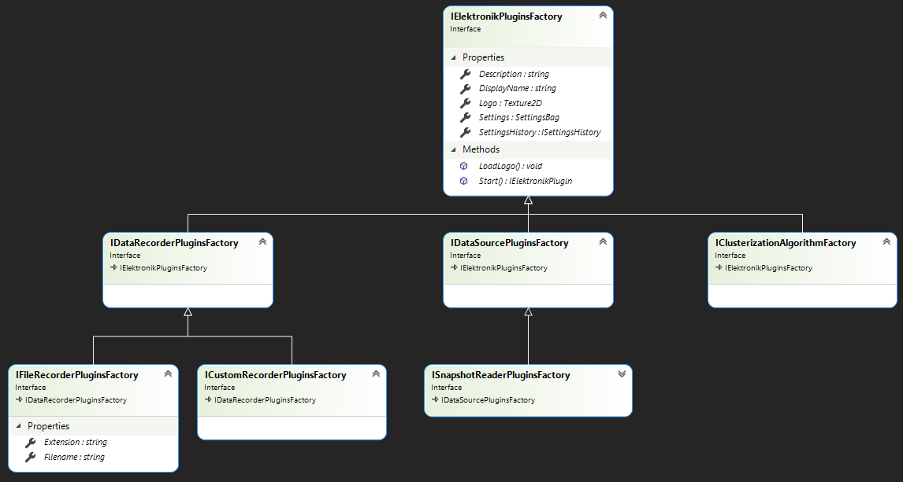
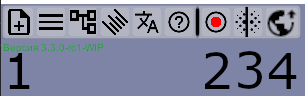
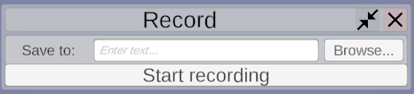
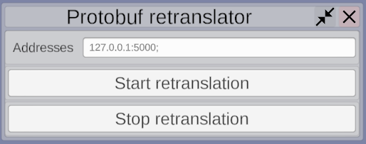

# Плагины для Электроника

Возможность расширения Электроника плагинами является одной из его важнейших частей.
Вся работа с протоколами приёма данных, чтением файлов и т.д. вынесена во внешние плагины,
сам Электроник занимается только отображением входящих данных. 
Поэтому с Электроником сразу поставляются несколько плагинов, для приема входящих данных: [Protobuf](Protobuf-RU.md), [ROS](ROS-RU.md).
Вы можете использовать их как образец при разработке своих плагинов.

В общем работа с плагинами выстроена следующим образом:
- Плагины источники данных предоставляют дерево контейнеров данных, и заполняют эти контейнеры данными.
- Электроник обписывает на обновление этих контейнеров объекты-рендереры, которые выводят данные на экран.
- В качестве рендереров могут выступать другие плагины, которые, например, будут записывать данные в файл. 


## Структура плагинов

Работа с плагиными выстроена по паттерну абстрактная фабрика. Каждый плагин должен определять класс фабрики реализующий интерфейс 
[IElektronikPluginsFactory](../Assets/Scripts/PluginsSystem/Factories/IElektronikPluginsFactory.cs), этот класс отвечает за предварительную настройку плагина
и его создание при вызове функции `IElektronikFactory.Start()`. Сам же плагин должен реализовывать интерфейс [IElektronikPlugin](../Assets/Scripts/PluginsSystem/Plugins/IElektronikPlugin.cs).

Сами плагины можно поделить на три группы (в будущем их число скорее всего будет расширяться), каждая из этих групп имеет собственный интерфейс фабрик и плагинов:
- Источники данных (Data source). Предоставляют данные для отображения в электронике.
  - Фабрики: 
    - [IDataSourcePluginsFactory](../Assets/Scripts/PluginsSystem/Factories/IDataSourcePluginsFactory.cs) Интерфейс фабрики для любых плагинов - источников данных.
    - [ISnapshotReaderPluginFactory](../Assets/Scripts/PluginsSystem/Factories/IDataSourcePluginsFactory.cs) наследник `IDataSourcedPluginsFactory`. 
      Указывает, что плагин может использоваться для чтения сохраненных в файл снапшотов.
  - Плагины:
    - [IDataSourcePlugin](../Assets/Scripts/PluginsSystem/Plugins/IDataSourcePlugin.cs) интерфейс для любых плагинов - источников данных.
- Записыватели данных (Data recorders). Потребляют данные полученные от источников.
  - Фабрики:
    - [ICustomRecorderPluginsFactory](../Assets/Scripts/PluginsSystem/Factories/IDataRecorderPluginsFactory.cs) Интерфейс фабрики для любых плагинов - потребителей данных.
    - [IFileRecorderPluginsFactory](../Assets/Scripts/PluginsSystem/Factories/IDataRecorderPluginsFactory.cs) Интерфейс фабрики для плагинов записывающих данные в файл.
      Нужен для того, чтобы удобно сгрупировать плагины этого типа в пользовательском интерфейсе. (Подробнее [далее](#Пользовательский-интерфейс)) 
  - Плагины:
    - [IDataRecorderPlugin](../Assets/Scripts/PluginsSystem/Plugins/IDataRecorderPlugin.cs) интерфейс для любых плагинов - потребителей данных.
- Алгоритмы сегментации облаков точек. Принимают список точек, возвращают список списков точек разбитых по определённому алгоритму.
  - Фабрика: [IClusterizationAlgorithmFactory](../Assets/Scripts/PluginsSystem/Factories/IClusterizationAlgorithmFactory.cs)
  - Плагин: [IClusterizationAlgorithm](../Assets/Scripts/PluginsSystem/Plugins/IClusterizationAlgorithm.cs)




Также плагины могут определять свой тип настроек унаследованный от [SettingsBag](../Assets/Scripts/Settings/Bags/SettingsBag.cs), 
для этих типов будет сгенерирован пользовательский интерфейс, который позволит пользователю изменять содержимое полей настроек. (Подробнее: [UI](#Пользовательский-интерфейс), [Настройки](#Настройки)

## Пользовательский интерфейс



С точки зрения UI плагины можно разделить на две группы:
- Плагины для которых UI реализован на стороне электроника.
  - **Источники данных** (1) Для этих плагинов создаётся одно окно на всех, в нем можно выбрать нужный, установить настройки (или использовать предыдущие),
  запустить проигрывание. Одновременно может быть запущен только один источник, поэтому перед запуском нового источника, старый будет остановлен.
  
  
  - **Плагины записывающие состояние сцены в файл** (2) Для этих плагинов создаётся одно окно на всех, 
  в этом окне можно выбрать файл в который будет вестись запись. Нужный плагин будет определён по расширению файла. 
  
  
  - Алгоритмы сегментации (3)
  
  
- Все остальные плагины.
  - Для остальных плагинов создается своя кнопка на панели инструментов. По нажатию на которое открывается окно со сгенерированными полями для изменения настроек.
  - Пример: **Плагин для передачи состояния сцены по gRPC** (4)
  
  

Логотип для плагинов берётся из файла `<Elektronik_DIR>/Plugins/<Plugin_Name>/data/<IElektronikPluginsFactory.DisplayName>_Logo.png`, 
если такой файл не был найден в панели инструментов будет использоапно полное название плагина.  

# Написать свой плагин

В данный момент Электроник поддерживает плагины, добавляющие новые типы источников данных, 
например протоколы передачи данных или форматы файлов.

Если вам не хватает тех форматов и протоколов, которые сейчас поддерживает Электроник, 
эта страница поможет вам написать плагин для поддержки именно вашего формата.

## Введение

Ваш плагин может быть написан на любом языке поддерживаемом средой .Net.
Для того чтобы плагин имел доступ к данным электроника, его сборка должна ссылаться на 
файлы `UnityEngine.dll`, `Assembly-CSharp.dll`, `Assembly-CSharp-firstpass.dll`.
Эти файлы поставляются вместе с Электроником и находятся в директории `<YOUR_ELEKTRONIK_DIR>\Elektronik_Data\Managed`.
Также вам возможно понадобится сослаться на другие сборки движка Unity. 
Например класс `Vector3` находится в `UnityEngine.CoreModule.dll`.

Ваш плагин должены содержать классы реализующие хотябы один из следующих интерфейсов
- [IDataSourceOnline](../Assets/Scripts/PluginsSystem/IDataSourceOnline.cs) для поддержки потоковых данных.
- [IDataSourceOffline](../Assets/Scripts/PluginsSystem/IDataSourceOffline.cs) если вы хотите написать плагин для чтения файлов.
  Или любых данных поддерживающих обратную перемотку.
  
Обратите внимание, что в онлайн режиме электроник способен принимать данные из нескольких источников одновременно.
Т.е. могут быть активны сразу несколько плагинов. В то время как в оффлайн режиме может использоваться 
отлько один источник данных.
  
## Общее

При реализации интерфейсов вам придется реализовать следующие функции и свойства:
```c#
/// <summary> Name to display in plugins settings. </summary>
string DisplayName { get; }

/// <summary> Plugins description. Will be displayed in plugins settings </summary>
string Description { get; }
```
- Просто название и описание плагина, котороые будут отображаться в меню настроек.
```c#
/// <summary> Converter for raw Vector3 and Quaternions </summary>
ICSConverter Converter { get; set; }
```
- При инициализации плагина в это свойство будет записан стандартный конвертер из правосторонней системы координат в
  используемую unity левостороннюю. Вы можете воспользоваться им для обработки входящих данных или использовать свой.

```c#
/// <summary> Containers with cloud data. </summary>
IContainerTree Data { get; }
```
- Корень дерева облачных данных. В электронике все данные об облачных объектах (точки, линии, плоскости) записываются в контейнеры,
  объединённые в древовидную структуру. Подробности в разделе [контейнеры облачных данных](#Контейнеры-облачных-данных). 
  В простейшем случае здесь должен находиться   контейнер содержащий, например, точки, 
  и реализующий интерфейсы `IContainerTree` и `IContainer<T>`. 
  Это свойство должно быть инициализированно статически или в конструкторе.
  
```c#
/// <summary> Containers with any data. </summary>
DataPresenter PresentersChain { get; }
```
- Цепочка контейнеров содержащих другие виды данных, например изображения или текст.
  Это свойство должно быть инициализированно статически или в конструкторе. Подробности в разделе 
  [Другие виды данных](#Другие-виды-данных)
  
```c#
/// <summary> Starts plugin. </summary>
void Start();
```
- Функция, внутри которой выполняется запуск плагина. К этому моменту в плагин уже гарантированно будут переданны настройки.
  Обратите внимание, что эта функция может быть вызвана несколько раз за время работы программы. Каждому новому вызову функции `Start()` 
  будет предшествовать вызов функции `Stop()`, кроме первого раза.
  
```c#
/// <summary> Stops plugin. </summary>
void Stop();
```
- Функция, внутри которой выполняется остановка плагина. 
  Обратите внимание, что эта функция может быть вызвана несколько раз за время работы программы. 
  Внутри этой функции вы должны выполнить очистку состояния и привести все данные к исходному виду до запуска плагина.
  
```c#
/// <summary> Calls every time when Unity.Update() event happens. </summary>
/// <param name="delta"> Time from previous update call in seconds. </param>
void Update(float delta);
```
- Функция выпоняющаяся каждый раз при отрисовке нового кадра в Unity. Вы пожете использовать её по своему собственному усмотрению,
  но помнить, что следующий кадр не будет нарисован до тех пор пока не выполнится `Update()`. По этому лучше воздержаться
  от тяжелых операций внутри этой функции.

```c#
/// <summary> Plugins settings. </summary>
SettingsBag Settings { get; set; }
```
- Объект хранящий настройки плагина. Например имя файла, который нужно открыть или порт для приёма данных. 
  Это свойство должно быть инициализированно статически или в конструкторе.
  Подробности в разделе [Настройки](#Настройки)

```c#
/// <summary> Container for settings history. </summary>
ISettingsHistory SettingsHistory { get; }
```
- Объект хранящий историю настройки плагина. Скорее всего вы не будете им пользоваться :)
  Это свойство должно быть инициализированно статически или в конструкторе.
  Подробности в разделе [Настройки](#Настройки)

## Онлайн режим

Для реализации онлайн режима создайте класс реализующий интерфейс 
[IDataSourceOnline](../Assets/Scripts/PluginsSystem/IDataSourceOnline.cs).
Вам не придётся реализовывать ничего кроме общих функций и свойств.

## Оффлайн режим

Для реализации оффлайн режима создайте класс реализующий интерфейс
[IDataSourceOffline](../Assets/Scripts/PluginsSystem/IDataSourceOffline.cs).
```c#
public interface IDataSourceOffline : IDataSource
{
    /// <summary> Amount of frames (commands) in file. </summary>
    int AmountOfFrames { get; }
    
    /// <summary> Displaying timestamp of current frame. </summary>
    int CurrentTimestamp { get; }
    
    /// <summary> Number of current frame. </summary>
    int CurrentPosition { get; set; }
    
    /// <summary> Play button pressed handler. </summary>
    void Play();
    
    /// <summary> Next button pressed handler. </summary>
    void Pause();
    
    /// <summary> Stop button pressed handler. </summary>
    void StopPlaying();
    
    /// <summary> Previous frame button pressed handler. </summary>
    void PreviousKeyFrame();
    
    /// <summary> Next frame button pressed handler. </summary>
    void NextKeyFrame();

    /// <summary> Reached end of the file. </summary>
    event Action Finished;
}
```
Также вам потребуется реализовать функции реагирующие на нажатие клавиш 
и свойства содержащие информацию о состоянии проигрывателя.

## Подключение плагинов

Ваш плагин должен представлять собой dll библиотеку и дополнительные файлы.
При запуске электроник будет искать плагины в директории `<YOUR_ELEKTRONIK_DIR>\Plugins`.
Ваш плагин должен иметь следующую структуру:
```
\Plugins
  \your_plugin_name
    \libraries
      \your_plugin.dll
      \additional_libs.dll
    \data
      \some_data.csv
```
Во время работы электроника пользователь должен будет выбрать какие плагины он хочет включить
и указать настройки для этих плагинов, например путь к файлу для проигрывания или порт для приёма данных.
После того когда плагины выбраны и настройки заданы и проверены на [валидность](#Настройки) может быть запущено проигрывание.

При запуске проигрывания контейнерам плагина будут переданы объекты для отображения данных и вызвана функция `Start()`.
Если пользователь решит вернуться на экран настроек, то будет вызвана функция `Stop()`.
Гарантированно, что функция `Update()` будет вызываться только между вызовами `Start()` и `Stop()`.

## Контейнеры облачных данных

Для хранения и отображения данных о точках, линиях и плоскостях в электронике используются контейнеры реализующие интерфейс
[IContainer\<T\>](../Assets/Scripts/Containers/IContainer.cs).
В можете написать контейнер для собственных данных, либо вопользоваться одним из 
[стандартных](../Assets/Scripts/Containers). Однако помните, что на данный момент электроник умеет отображать только
- облака точек (T=[SlamPoint](../Assets/Scripts/Data/PackageObjects/SlamPoint.cs)),
- линий (T=[SlamLine](../Assets/Scripts/Data/PackageObjects/SlamLine.cs)),
- бесконечных плоскостей (T=[SlamInfinitePlane](../Assets/Scripts/Data/PackageObjects/SlamInfinitePlane.cs)),
- а также граф наблюдений (T=[SlamObservation](../Assets/Scripts/Data/PackageObjects/SlamObservation.cs)),
- и треки отслеживаемых объектов (T=[SlamTrackedObject](../Assets/Scripts/Data/PackageObjects/SlamTrackedObject.cs)).

Для отображения приведите ваши данные к одному из указанных выше типов, либо реализуйте свой 
[класс для отображения данных](API-RU.md#Классы-для-отображения-данных).

Для удобной группировки контейнеры также должны реализовывать интерфейс [IContainerTree](../Assets/Scripts/Containers/IContainerTree.cs)
и быть выстроены в древовидную структуру. При запуске проигрывания перед вызовом функции `Start()` будет вызвана 
функция `Data.SetRenderer(renderer)` в которую последовательно будут переданы все классы отображающие облачные данные.
Если вы реализуете свой тип контейнера, то внутри этой функции вы должны будете подписать соответствующий класс рендера
на обновления вашего контейнера. Например так:
```c#
public void SetRenderer(object renderer)
{
  if (renderer is ICloudRenderer<SlamLine> typedRenderer)
  {
      OnAdded += typedRenderer.OnItemsAdded;
      OnUpdated += typedRenderer.OnItemsUpdated;
      OnRemoved += typedRenderer.OnItemsRemoved;
      if (Count > 0)
      {
          OnAdded?.Invoke(this, new AddedEventArgs<SlamLine>(this));
      }
  }
  foreach (var child in Children)
  {
      child.SetRenderer(renderer)
  }
}
```
Если в вашем плагине будут использоваться несколько контейнеров, то вам придется создать корневой контейнер, 
в котором будут находиться все остальные. 
[Пример](../plugins/Protobuf/Data/ProtobufContainerTree.cs) можно посмотреть в плагине Protobuf.

## Другие виды данных

Так же вам может потребоваться выводить другие виды данных, например изображения с камеры.
Для этого используйте класс [DataPresenter](../Assets/Scripts/Presenters/DataPresenter.cs).
Этот класс реализует паттерн цепочка ответственности и в вашей реализации может выполнять парсинг входящих данных
и передавать их в UI для отображения. При запуске проигрывания перед вызовом функции `Start()` будет вызвана
функция `PresentersChain.SetRenderer(renderer)` в которую последовательно будут переданы все классы отображающие облачные данные.
Если вы реализуете свой тип, то внутри этой функции вы должны будете подписать соответствующий класс рендера
на обновления вашего контейнера. Например так:
```c#
if (dataRenderer is IDataRenderer<byte[]> renderer)
{
    _renderer = renderer;
}
Successor?.SetRenderer(dataRenderer);
```

## Настройки

Для реализации настроек вашего плагина создайте класс наследующий [SettingsBag](../Assets/Scripts/Settings/SettingsBag.cs)
и помеченный аттрибутом `Serializable`
Все публичные поля этого класса будут считаться настройками вашего плагина и выведены на экран в меню настроек.
Если вы не хотете показывать поле пользователю, пометьте его аттрибутом `NotShow`.
Пометьте поля аттрибутом `Tooltip(string)` для того, чтобы указать название под которым эта настройка будет отображаться пользователю,
иначе за название настройки будет принято имя переменной.

Если вам необходимо проверить корректность настроек, например существование файла, который собирается проиграть пользователь, 
переопределите функцию `bool Validate()`, она должна возвращать `true`, если настройки корректны. 
Проигрывание не будет запущено пока у всех включенных плагинов не будут установлены корректноые настройки.

Несколько самых популярных типов настроек уже реализованы и вы можете использовать их в своих плагинах:
[AddressPortScaleSettingsBag](../Assets/Scripts/Settings/Bags/AddressPortScaleSettingsBag.cs)
[FileScaleSettingsBag](../Assets/Scripts/Settings/Bags/FileScaleSettingsBag.cs)

Для хранения истории настроек сделайте специализацию класса [SettingsHistory\<T\>](../Assets/Scripts/Settings/SettingsHistory.cs),
где в качестве T укажите ваш класс настроек. Больше в нём не потребуется ничего реализовывать. 

Инициализируйте свойства
```c#
/// <summary> Plugins settings. </summary>
SettingsBag Settings { get; set; }
/// <summary> Container for settings history. </summary>
ISettingsHistory SettingsHistory { get; }
```
в своём плагине статически или в конструкторе, используя созданный вами классы.

Или вместо специализации класса [SettingsHistory\<T\>], можете унаследовать класс [DataSourceBase\<T\>], где T - класс настроек,
в котором уже реализована работа с историей настроек.

Вся история настроек хранится в `C:\Users\<User>\AppData\LocalLow\Dioram\Elektronik\<Plugin.DisplayName>.json`.

[<- Внутреннее API](API-RU.md) | [Окна для вывода дополнительных данных ->](Windows-RU.md)