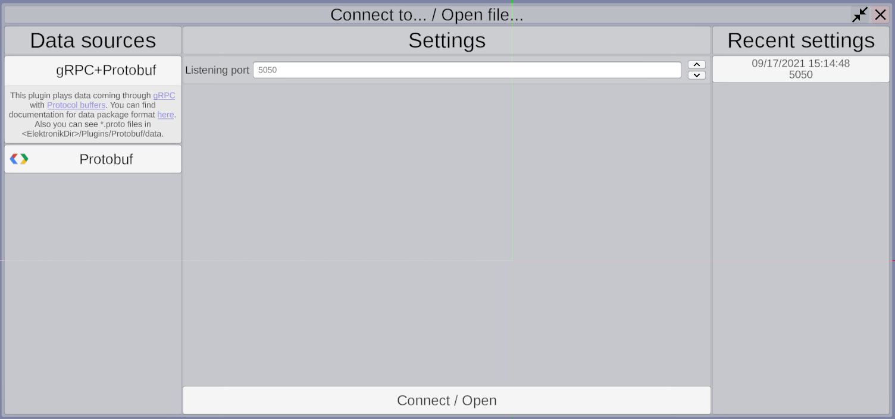
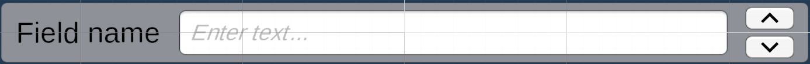

# Плагины для Электроника

Возможность расширения Электроника плагинами является одной из его важнейших частей.
Вся работа с протоколами приёма данных, чтением файлов и т.д. вынесена во внешние плагины,
сам Электроник занимается только отображением входящих данных. 
Поэтому с Электроником сразу поставляются несколько плагинов, для приема входящих данных: [Protobuf](Protobuf-RU.md), 
[ROS](ROS-RU.md).Вы можете использовать их как образец при разработке своих плагинов.

В общем работа с плагинами выстроена следующим образом:
- Плагины источники данных предоставляют дерево источников данных, и заполняют эти источники данными.
- Электроник подписывает на обновление этих контейнеров объекты - потребители данных, 
  например объекты которые выводят данные на экран.
- В качестве потребителей данных могут выступать другие плагины, которые, например, будут записывать данные в файл. 

## Структура плагинов

Работа с плагинами выстроена по паттерну абстрактная фабрика. 
Каждый плагин должен определять класс фабрики реализующий интерфейс 
[IElektronikPluginsFactory](../Assets/Scripts/PluginsSystem/Factories/IElektronikPluginsFactory.cs), 
этот класс отвечает за предварительную настройку плагина
и его создание при вызове функции `IElektronikFactory.Start()`. 
Сам же плагин должен реализовывать интерфейс [IElektronikPlugin](../Assets/Scripts/PluginsSystem/Plugins/IElektronikPlugin.cs).

Сами плагины можно поделить на три группы (в будущем их число скорее всего будет расширяться), 
каждая из этих групп имеет собственный интерфейс фабрик и плагинов:
- Источники данных (Data source). Предоставляют данные для отображения в электронике.
  - Фабрики: 
    - [IDataSourcePluginsFactory](../Assets/Scripts/PluginsSystem/Factories/IDataSourcePluginsFactory.cs) 
      Интерфейс фабрики для любых плагинов - источников данных.
    - [ISnapshotReaderPluginFactory](../Assets/Scripts/PluginsSystem/Factories/IDataSourcePluginsFactory.cs)
      наследник `IDataSourcedPluginsFactory`. Указывает, что плагин может использоваться для чтения сохраненных в файл снапшотов.
  - Плагины:
    - [IDataSourcePlugin](../Assets/Scripts/PluginsSystem/Plugins/IDataSourcePlugin.cs) интерфейс для любых плагинов - источников данных.
- Записыватели данных (Data recorders). Потребляют данные полученные от источников.
  - Фабрики:
    - [ICustomRecorderPluginsFactory](../Assets/Scripts/PluginsSystem/Factories/IDataRecorderPluginsFactory.cs) 
      Интерфейс фабрики для любых плагинов - потребителей данных.
    - [IFileRecorderPluginsFactory](../Assets/Scripts/PluginsSystem/Factories/IDataRecorderPluginsFactory.cs) 
      Интерфейс фабрики для плагинов записывающих данные в файл.
      Нужен для того, чтобы удобно сгрупировать плагины этого типа в пользовательском интерфейсе. 
      (Подробнее [далее](#Пользовательский-интерфейс)) 
  - Плагины:
    - [IDataRecorderPlugin](../Assets/Scripts/PluginsSystem/Plugins/IDataRecorderPlugin.cs) интерфейс для любых плагинов - потребителей данных.
- Алгоритмы сегментации облаков точек. Принимают список точек, возвращают список списков точек разбитых по определённому алгоритму.
  - Фабрика: [IClusteringAlgorithmFactory](../Assets/Scripts/PluginsSystem/Factories/IClusteringAlgorithmFactory.cs)
  - Плагин: [IClusteringAlgorithm](../Assets/Scripts/PluginsSystem/Plugins/IClusteringAlgorithm.cs)

Также плагины могут определять свой тип настроек унаследованный от [SettingsBag](../Assets/Scripts/Settings/SettingsBag.cs), 
для этих типов будет сгенерирован пользовательский интерфейс, который позволит пользователю изменять содержимое полей настроек. 
(Подробнее: [UI](#Пользовательский-интерфейс), [Настройки](#Настройки)

## Пользовательский интерфейс

С точки зрения UI плагины можно разделить на две группы:
- Плагины для которых UI реализован на стороне электроника.
  - **Источники данных** (1) Для этих плагинов создаётся одно окно на всех, в нем можно выбрать нужный, установить настройки (или использовать предыдущие),
  запустить проигрывание. Одновременно может быть запущен только один источник, поэтому перед запуском нового источника, старый будет остановлен.
  
  

  - **Плагины записывающие состояние сцены в файл** (2) Для этих плагинов создаётся одно окно на всех, 
  в этом окне можно выбрать файл в который будет вестись запись. Нужный плагин будет определён по расширению файла. 
  
  

  - **Алгоритмы сегментации** (3)
  
  

- Все остальные плагины.
  - Для остальных плагинов создается своя кнопка на панели инструментов. По нажатию на которое открывается окно со сгенерированными полями для изменения настроек.
  - Пример: **Плагин для передачи состояния сцены по gRPC** (4)
  
  

Логотип для плагинов берётся из файла `<Elektronik_DIR>/Plugins/<Plugin_Name>/data/<IElektronikPluginsFactory.DisplayName>_Logo.png`, 
если такой файл не был найден в панели инструментов будет использовано полное название плагина.  

## Настройки

Каждый плагин и его фабрика может определять настройки, для которых будет сгенерирован UI через который пользователь сможет их изменить.
Для этого настроки должны быть унаследованы от класса [SettingsBag](../Assets/Scripts/Settings/SettingsBag.cs).
UI будет сгенерирован для всех публичных полей с поддерживаемым типом и не помеченных атрибутом 
[\[Hide\]](../Assets/Scripts/Settings/HideAttribute.cs). 
Название поля в UI будет получено из названия поля в C# с помощью [Humanizer](https://github.com/Humanizr/Humanizer).
Так же вы можете дополнительно пометить поля атрибутом `[Tooltip("text")]` для вывода дополнительной информации при 
наведении курсора мыши на поле. Поддерживаемые типы полей:
- `bool` 

  

- `int`, `float` 

- 

- `int`, `float` с атрибутом `[Range(minValue, maxValue)]` 

- 

- `string` 

- 

- `string` с атрибутом [\[Path\]](../Assets/Scripts/Settings/PathAttribute.cs) 

- 

- `Vector3` 

- 

- `Action` 

- 

[SettingsBag](../Assets/Scripts/Settings/SettingsBag.cs) определяет виртуальный метод `Validate()`, 
который вы можете переопределить на своё усмотрение. Для плагинов источников данных и алгоритмов кластеризации,
результат этого метода проверяется в UI, и плагин будет запущен, только если настройки фабрики возвращают 
[ValidationResult.Succeeded](../Assets/Scripts/Settings/ValidationResult.cs).

В [SettingsBag](../Assets/Scripts/Settings/SettingsBag.cs) реализован метод `Equals`, он проверяет на равенство 
все публичные поля помеченные атрибутом [CheckForEquals](../Assets/Scripts/Settings/CheckForEqualsAttribute.cs).

На данный момент поля [SettingsBag](../Assets/Scripts/Settings/SettingsBag.cs) связан с UI односторонне, 
данные приходят из UI в код. В будущем будет реализована двухсторонняя связь.

Вся история настроек хранится в `C:\Users\<User>\AppData\LocalLow\Dioram\Elektronik\<Plugin.DisplayName>.json`.

[<- Внутреннее API](API-RU.md) | [Написать свой плагин ->](WritePlugin-RU.md)