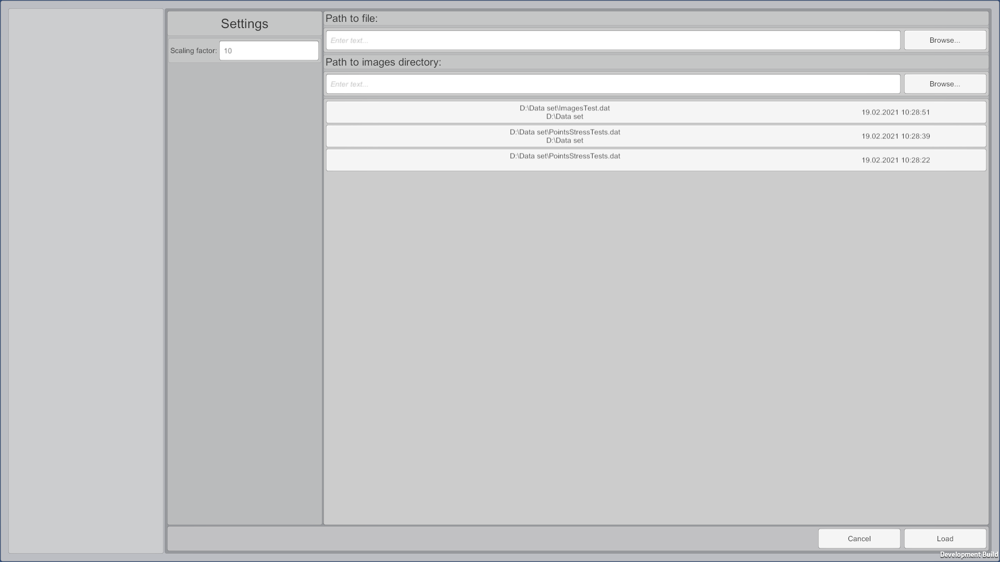
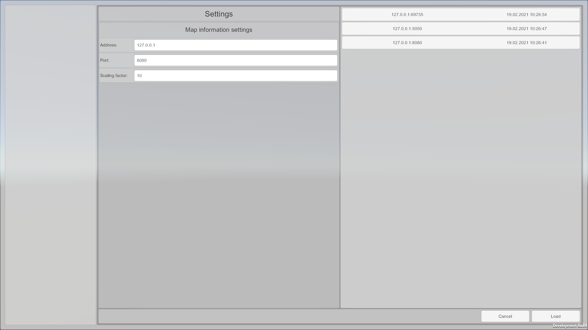
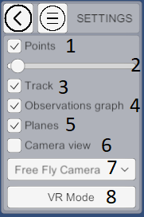

### The work with Elektronik Tools 2.0 starts from the main menu.

In the main menu you can select one of the modes of interaction with the Electronics.
1. [Online mode](#Online) - data is transferred via TCP connection.
2. [Offline mode](#Offline) - data is read from a file.

You can view the format of the input data on [this page](Data-EN.md).

# Offline

When you select the offline mode you will see the settings window.

In this window you can select a file, specify the directory with images form camera (not necessary)
and the scaling factor which will be applied to read data.
After the file selection it is necessary to click Load button. 
If Load button is disabled it means that the file has not been found and you have to check the path to it.

After the successful file loading you will see the following window.

If the file is large enough it is necessary to wait until it is processed.

The picture above indicates the following controls and display information:

1. Return to the offline mode settings menu.
2. [Settings](#Settings)
3. Event information window.
4. Objects with "special" information will be listed in this area. 
   Enumerations will be presented in the form of buttons. 
   After clicking them the camera will move to the object and information 
   about this object will appear in the upper part of the screen.
5. Start playing events from file. For a fast rewind use the slider (see p.10).
6. Pause playback.
7. Stop playback. It stops playing and clears the scene. Also you can use it just to clean scene.
8. Rewind to the previous key event. (hotkey `[`)
9. Rewind to the next key event. (hotkey `]`)
10. Event rewind slider. With this slider you can rewind events. 
    During the rewind, the information is not drawn for each of the rewinded events. 
    Redrawing occurs only for the event to which you want to rewind. 
    
# Online

When you select the online mode you will see the settings window.

At this window you can see the following settings:

1. IP address of TCP server from which the data will be recieved.
2. TCP Server port from which the data will be recieved.
3. Scaling factor of input data.

After setting all required settings it is necessary to click the Load button.
If the button is disabled check the IP address and port. Note that connection 
is not established immediately by pressing the Load button, therefore you can load scene even if the server does not work yet.

After that you will go to the next scene.

Unlike the offline mode, there is no playback control in online mode and also some UI elements are missing for improved performance.

Management in the online mode is as follows:

1. Return to connection settings.
2. [Settings](#Settings)
3. Clearing the scene. Do not use it while receiving the data! 
   Updating the map takes place incrementally so premature cleaning will result in an error.
4. Connection status.

# Settings

Common settings for both modes.

1. Turn on/off display of the cloud points. Adding points to the cloud does not turn off.
2. Slider for changing point size,
3. Turn on/off display of the tracks.
4. Turn on/off display of the observations. Adding observations to the visibility graph does not turn off.
5. Turn on/off display of planes.
6. Turn on/off images form camera.
7. Switch of camera type (presently implemented only free camera).
11. Switch to VR mode (see [VR mode](#VR-mode)).

# Observations

Elektronik can show additional information about observation.
If you hover mouse over observation object you will see floating window.
You can pin this window by clicking on observation.
In online mode you will see only text information about observation.
In offline you can also see images taken at moment of observation if images directory has been set.
You can learn more about this function [here](Data-EN.md#Observations)

# Images form camera.

If "Camera view" setting is turned on you will see window in bottom-right corner.
Here will be shown actual images from camera.
If you want to know how to send images check [here](Data-EN.md#Image-package).
This function works in both modes, but in offline you should set images directory.

# VR Mode
This mode works only if you have connected a VR helmet and it is supported by Unity (
for example, if it is supported in SteamVR). In the VR mode you will see the scene from VR helmet 
and watch the process of building a map.

In this mode you can bind the position of the connected helmet or replace this position with coordinates 
that are generated by your algorithm. In "VR Settings" you can switch between 
[online mode](#Оnline) and [offline mode](#Offline).

[<- Start page](Home-EN.md) | [Data transfer format ->](Data-EN.md)