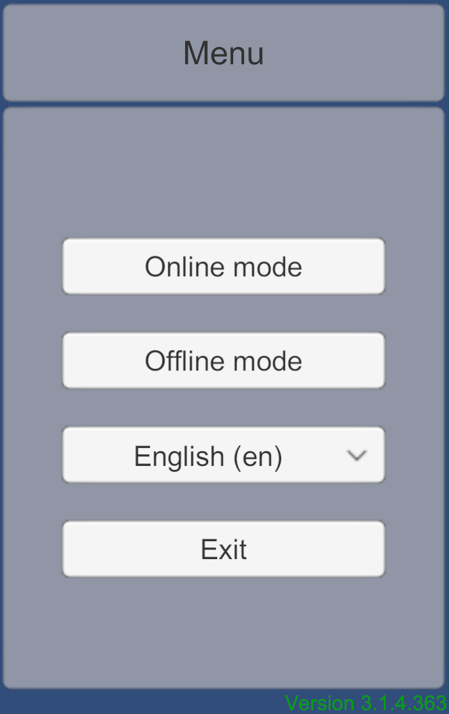
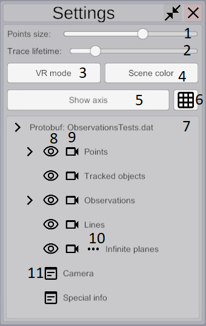

### The work with Elektronik Tools 2.0 starts from the main menu.

In the main menu you can select one of the modes of interaction with the Electronics.
1. [Online mode](#Online) - for uncontrollable data stream. Mostly using for realtime data.
2. [Offline mode](#Offline) - for data stream which can be stopped or rewinded. Mostly using for data written in file.

For now Elektronik uses [google protocol buffers](https://developers.google.com/protocol-buffers/?hl=en)
and [gRPC](https://grpc.io/).
You can view the format of the input data on [this page](Protobuf-EN.md).
You can extend Elektronik with [plugins](Plugins-EN.md) to support your own protocols and file formats.

# Settings

When you select mode you will see this settings window. Here you can select plugins and set their settings.
In offline mode Elektronik supports only one active data source. So in this mode you can choose only one data source plugin.

1. Back to main menu.
2. Plugins panel.
3. Toggle for plugins activation.
4. Settings panel.
5. Panel of settings history.
6. Error messages.
7. Start playing.

# Player controls

1. Back to settings.
2. Show scene settings window.

1. Points size slider.
2. Lifetime of traces of moved points.
3. Switch to VR mode (see [VR mode](#VR-mode)).
4. Scene background color.
5. Show / hide axis.
6. Show / hide grid.
7. Data source tree.
8. Turn on / off visibility of chosen cloud.
9. Look at this cloud.
10. Turn on / off moved point traces.
11. Open window for this type of data.

# Camera controls
- Keyboard:
    - WASD - to move camera forward/backward or to left/right.
    - QE - to move camera up or down
    - Arrow buttons - rotate camera
    - R - return camera to (0, 0, 0)
- Mous:
    - Hold right mouse button and move mouse to rotate camera.
    - Use mouse wheel to move camera forward or backward.
-  Button "Look at" for some data sources can move camera to see all data of chosen type.
# Offline

The picture above indicates the following controls and display information:

1. Play / pause
2. Stop and return at beginning
3. Rewind to previous key frame
4. Rewind to next key frame
5. Time line
6. Timestamp (specific time format depends on your data plugin)
    
# Online

Unlike the offline mode, there is no playback control in online mode and also some UI elements are missing for improved performance.
In this mode you can only clear the scene by pressing button in bottom-left corner.
Do not use it while receiving data if your data source sends it incrementally (like protobuf plugin)!
It can cause an error.

# Observations

Elektronik can show additional information about observation.
If you hover mouse over observation object you will see floating window.
You can pin this window by clicking on observation.
In online mode you will see only text information about observation.
In offline you can also see images taken at moment of observation if images directory has been set.

# VR Mode
This mode works only if you have connected a VR helmet and it is supported by Unity (
for example, if it is supported in SteamVR). In the VR mode you will see the scene from VR helmet 
and watch the process of building a map.

[<- Start page](Home-EN.md) | [Internal API ->](API-EN.md)