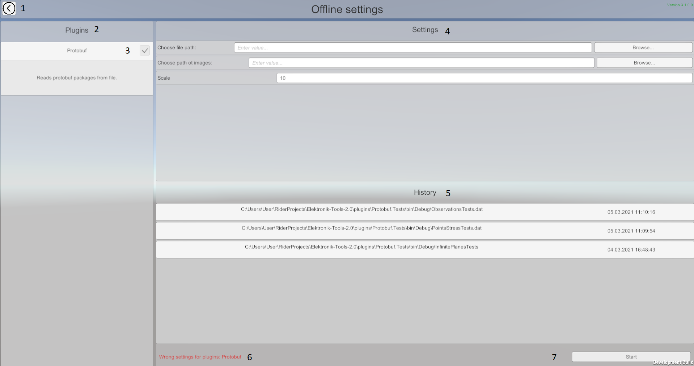

### The work with Elektronik Tools 2.0 starts from the main menu.

In the main menu you can select one of the modes of interaction with the Electronics.
1. [Online mode](#Online) - for uncontrollable data stream. Mostly using for realtime data.
2. [Offline mode](#Offline) - for data stream which can be stopped or rewinded. Mostly using for data written in file.

For now Elektronik uses [google protocol buffers](https://developers.google.com/protocol-buffers/?hl=en)
and [gRPC](https://grpc.io/).
You can view the format of the input data on [this page](Protobuf-EN.md).
You can extend Elektronik with [plugins](Plugins-EN.md) to support your own protocols and file formats.

# Settings

When you select mode you will see this settings window. Here you can select plugins and set their settings.
In offline mode elektronik supports only one active data source. So in this mode you can choose only one data source plugin.

1. Back to main menu.
2. Plugins panel.
3. Toggle for plugins activation.
4. Settings panel.
5. Panel of settings history.
6. Error messages.
7. Start playing.

# Player controls

1. Back to settings.
2. Hide/Expand player controls panel.

1. Points size slider.
2. Turn on/off images form camera.
3. Switch of camera type (presently implemented only free camera). 
4. Switch to VR mode (see [VR mode](#VR-mode)).
5. Clouds tree. Allows you to control visibility of any objects cloud. Clouds updates even if they are invisible.

# Offline

The picture above indicates the following controls and display information:

1. Return to the settings menu.
2. [Player controls](#Player-controls)
3. Event information window.
4. Objects with "special" information will be listed in this area. 
   Enumerations will be presented in the form of buttons. 
   After clicking them the camera will move to the object and information 
   about this object will appear in the upper part of the screen.
5. Start playing events from file. For a fast rewind use the slider (see p.10).
6. Pause playback.
7. Stop playback. It stops playing and clears the scene. Also you can use it just to clean scene.
8. Rewind to the previous key event. (hotkey `[`)
9. Rewind to the next key event. (hotkey `]`)
10. Event rewind slider. With this slider you can rewind events. 
    During the rewind, the information is not drawn for each of the rewinded events. 
    Redrawing occurs only for the event to which you want to rewind. 
    
# Online

Unlike the offline mode, there is no playback control in online mode and also some UI elements are missing for improved performance.

Management in the online mode is as follows:

1. Return to connection settings.
2. [Settings](#Settings)
3. Clearing the scene. Do not use it while receiving the data! 
   Updating the map takes place incrementally so premature cleaning will result in an error.
4. Connection status.

# Observations

Elektronik can show additional information about observation.
If you hover mouse over observation object you will see floating window.
You can pin this window by clicking on observation.
In online mode you will see only text information about observation.
In offline you can also see images taken at moment of observation if images directory has been set.

# Images form camera.

If "Camera view" setting is turned on you will see window in bottom-right corner.
Here will be shown actual images from camera.
This function works in both modes, but in offline you should set images directory.

# VR Mode
This mode works only if you have connected a VR helmet and it is supported by Unity (
for example, if it is supported in SteamVR). In the VR mode you will see the scene from VR helmet 
and watch the process of building a map.

In this mode you can bind the position of the connected helmet or replace this position with coordinates 
that are generated by your algorithm. In "VR Settings" you can switch between 
[online mode](#Оnline) and [offline mode](#Offline).

[<- Start page](Home-EN.md) | [Internal API ->](API-EN.md)