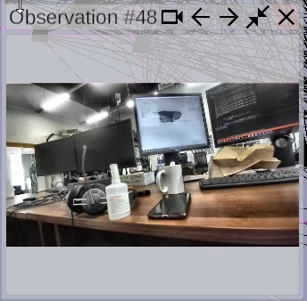

# Elektronik Tools user manual

### After launch of Elektronik you will see empty scene, connections window, and some scene and playback controls.

Main contolrs:
1. **Toolbar** Here you will see buttons for calling windows with additional settings and controls. ([More](#Toolbar)).
2. **Connections window -> List of available data sources** Here you can chose source of data that Elektronik will render.
   For example, chose reading from Protobuf file or listening from port using gRPC. (Other variants can be added by [plugins](Plugins-EN.md)).
3. **Connections window -> Connection settings** Here you can set some setting that are necessary for connection such as path to file or port for listening.
4. **Connections window -> Recent settings** Here you have fast access to recent connection settings.
5. **Scene tools window** Here you can see some controls of rendering data. ([More](#Scene-tools)).
6. **Data tree window** Here you can see all data sources grouped in tree structure. ([More](#Data-tree)).
7. **Player controls** ([More](#Player-controls)).
8. **Camera orientation widget** Shows camera orientations and allows you to align camera to axis.

## Toolbar

Buttons:
- Show connections window.
- Show scene tools window.
- Show data tree window.
- Show windor for choosing language.
- Show help window.
- *All buttons after separator are added by plugins* 
- Recording scene state to file.
- Point cloud segmentation.
- Translation scene state via gRPC/Protobuf.

## Scene tools

This window alows you to control:
- Points size
- Lines transparency 
- Lifetime of trace of moving points (If trace rendering turned on for points container).
- Scene scale.
- background color.
- Toggle axes rendering.
- Toggle grid rendering.
- Take snapshot of current scene state.
- Load saved snapshot from file.
- Got to VR mode (only if you are using Elektronik build with VR support)
- Toggle logging. This option is disabled by default because, during continuous run it can generate gigabytes of log on drive C:/ (/home on linux).

## Data tree

This window shows containers with data grouped into tree structure.

-  Toggle visibility of this container.
-  Move camera to this container. Or tracked objects it also make camera follow this object.
-  Open window for this container.
-  Toggle rendering of trace for moving points.
-  Filters observation graph by edge weight. 
-  Toggles mesh color (white or vertex).
-  Saves container's content to file.
-  Removes container.

## Camera controls
- Keyboard:
  - WASD - to move camera forward/backward or to left/right.
  - QE - to move camera up or down
  - Arrow buttons - rotate camera
  - Backspace - return camera to (0, 0, 0)
- Mouse:
  - Hold right mouse button and move mouse to rotate camera.
  - Hold both mouse buttons to move camera forward.
  - Use mouse wheel to move camera forward or backward.
-  Button "Look at" for some data sources can move camera to see all data of chosen type.

## Player controls

The picture above shows following controls and display information:
1. Play / pause;
2. Stop and return at beginning (for plugins that getting information from online source this button will clear scene);
3. Rewind to previous key frame
   (Key frames support implements on plugins side. If plugin does not support key frames this button will move to next frame);
4. Rewind to next key frame;
5. Playback speed controls;
6. Time line;
7. Timestamp (specific time format depends on your data plugin);

## Hot keys

- F1 - Show help window.
- Space - Play / pause.
- Ctrl-Delete - Stop playback.
- . - Next frame.
- , - Previous frame.
- ] - Next key frame.
- [ - Previous key frame.
- Ctrl+N - Show connections window.
- Ctrl+T - Take snapshot.
- Ctrl+O - Load snapshot.
- Ctrl+F - Show records window / stop recording.
- Ctrl+Y - Show scene tools window.
- Ctrl+U - Show window for point cloud clusterization.
- Ctrl+G - Toggle grid.
- Ctrl+H - Toggle axes.
- Ctrl+M - Toggle mesh color (white color or vertex color).
- F2 - Go to VR mode.
- F3 - Show VR help window.

## Observations

Elektronik can show additional information about observation such as camera image and message.
If you hover mouse over observation object you will see floating window.
You can pin this window by clicking on observation.
Also in window's header you can see buttons that allow you to move to previous/next observation and move camera to current observation.

## VR Mode
This mode works only if:
- you have connected a VR helmet,
- it is supported by Unity (for example, if it is supported in SteamVR),
- you are using Elektronik build with VR support. 
In the VR mode you will see the scene from VR helmet and watch the process of map building.

[<- Build from source](Build-EN.md) | [Internal API ->](API-EN.md)