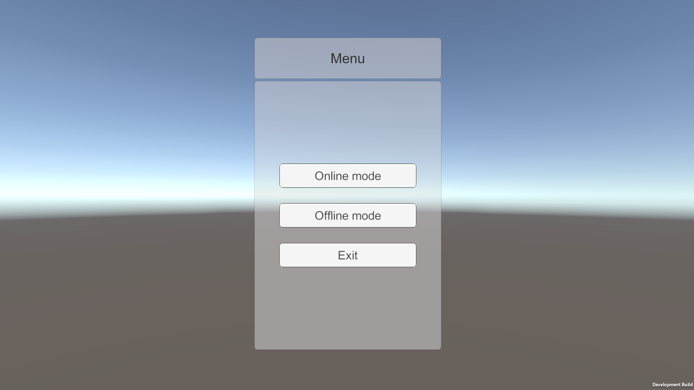
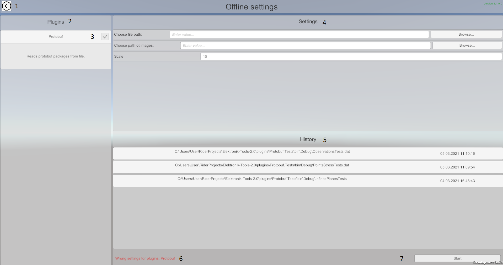
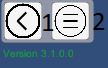
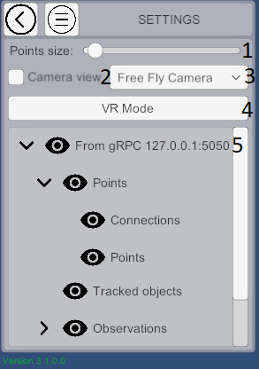
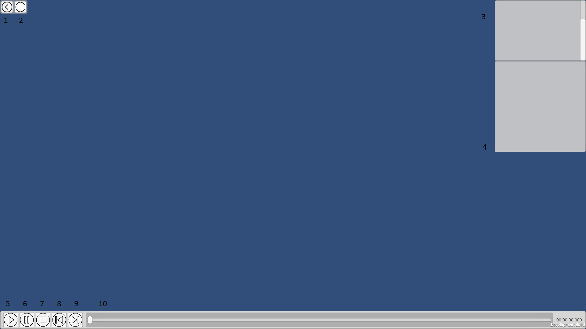

### Работа с Elektronik Tools 2.0 начинается с главного меню

В главном меню Вы можете выбрать один из режимов взаимодействия с Электроником.
1. [Онлайн режим](#Онлайн) - принимается неконтролируемый поток данных. 
   Используется преимущественно для демонстрации данных приходящих в реальном времени.
2. [Оффлайн режим](#Оффлайн) - принимается поток данных который можно останавливать и перематывать. 
   Используется преимущественно для демострации данных записанных в файл.

На данный момент Elektronik использует формат обмена данными
[google protocol buffers](https://developers.google.com/protocol-buffers/?hl=en) и [gRPC](https://grpc.io/).
С документацией по использованию этих фреймворков можно ознакомиться по предоставленным ссылкам.
Ознакомиться с форматом входных данных Вы сможете на [этой странице](Protobuf-RU.md).
Вы можете расширить электроник [плагинами](Plugins-RU.md) для поддержки нужных вам протоколов.

# Настройки

После выбора режима вы попадёте на экран настроек. Здесь вы сможете выбрать какие плагины использовать и указать им настройки,
например выбрать файл для воспроизведения или порт для приёма данных.
Необходимо отметить, что в оффлайн режиме электроник не поддреживает работу с несколькими источниками данных одновременно.
По этому в оффлайн режиме можно выбрать только один плагин предоставляющий источник данных.

1. Возврат в главное меню.
2. Панель плагинов.
3. Преключатель для включения/отключения плагинов.
4. Панель настроек уникальных для каждого плагина.
5. Панель истории настроек для каждого плагина.
6. Сообщения об ошибке запуска плагинов.
7. Запуск воспроизведения.

# Управление проигрывателем

 

1. Вернуться к настройкам
2. Развернуть/свернуть панель управления воспроизведением.

1. Ползунок изменения размера точек
2. Включить / выключить отображение изображения с камеры.
3. Сменить тип камеры (пока доступен только один: свободная камера).
4. Переключение в VR режим (см. [VR режим](#VR-режим)).
5. Дерево облаков. Позволяет управлять отображением отдельных видов облаков. 
   При выключенном отображении всё равно происходит обновление облаков.

# Оффлайн

На картинке выше обозначены следующие элементы управления и отображения информации:

1. Вернуться к выбору файла
2. [Управление проигрывателем](#Управление-проигрывателем)
3. Окно отображения информации о событии.
4. В данной области будут перечислены объекты со "специальной" информацией. 
    Перечисления будут представлены в виде кнопок, по нажатию на которые камера переместится к объекту, 
    а в верхней центральной части экрана появится информация об этом объекте.
5. Начать проигрывание событий записанных в файле. Для того, чтобы быстро отмотать вперёд используйте ползунок (см. п. 10)
6. Приостановить проигрывание.
7. Остановить проигрывание. Останавливает проигрывание и очищает сцену. Можно также использовать просто для очистки сцены.
8. Промотать до предыдущего ключевого события. (Клавиша '[')
9. Промотать до следующего ключевого события. (Клавиша ']')
10. Ползунок перемотки событий. С помощью данного ползунка Вы сможете перематывать события. 
    Во время перемотки информация не отрисовывается для каждого из перематываемых событий. 
    Перерисовка происходит только на событии, к которому необходимо перемотать. 

# Онлайн

1. Вернуться к настройкам подключения.
2. [Общие настройки](#Настройки).
3. Очистка сцены. Не применяйте её во время приёма данных! 
   Обновление карты происходит в инкрементном стиле, поэтому преждевременная очистка приведёт к ошибке.
4. Статус подключения.

# Наблюдения

Elektronik позволяет увидеть дополнительную информацию о наблюдении, при наведении курсора мыши с помощью высплывающего окна.
При клике по наблюению, данное окно будет закреплено слева-снизу.
Отображение текстовой информации работает в обоих режимах, тогда как изображения только в оффлайн, 
и если была указана директория в которой они хранятся.

# Изображения с камеры

При включенной [настройке](Настройки) "Camera view", в правом нижнем углу будет закреплено окно,
в котором будут отображаться изображения с камеры.
Данная функция работает в обоих режимах, но для оффлайн необходимо указать директорию в которой сохранены изображения.

# VR-режим

Этот режим сработает, только если у Вас подключен VR шлем и он поддерживается Unity 
(например, если он поддерживается в SteamVR). В VR режиме Вы будете видеть сцену из VR шлема и наблюдать процесс построения карты.

В данном режиме Вы можете привязаться либо к позиции подключенного шлема, либо подменить эту позицию координатами, 
которые генерируются Вашим алгоритмом. Настроить поведение Вы сможете в "VR Settings" из 
[онлайн режима](#Онлайн) или [оффлайн режима](#Оффлайн).

[<- Стартовая страница](Home-RU.md) | [Внутреннее API ->](API-RU.md)