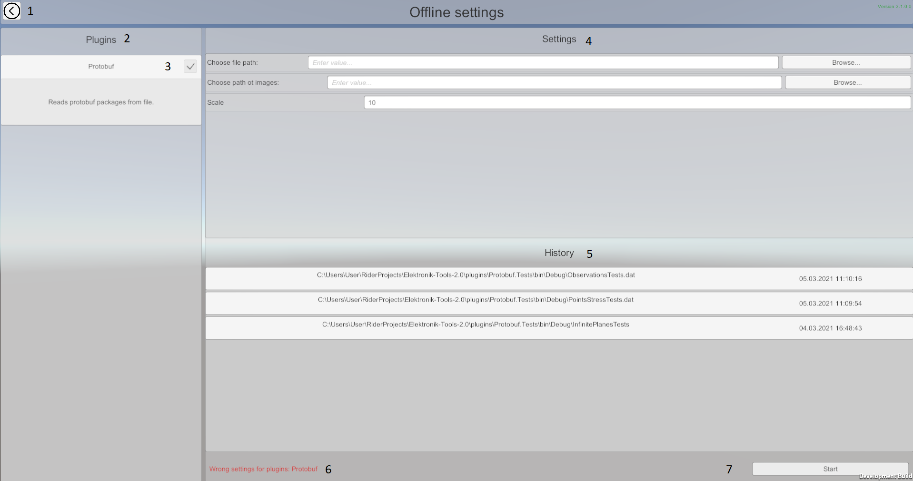
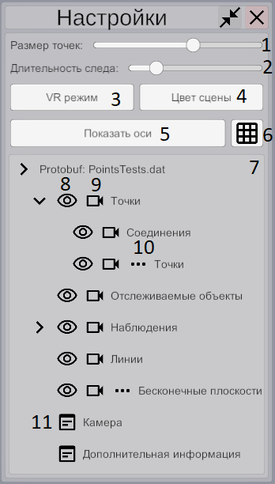
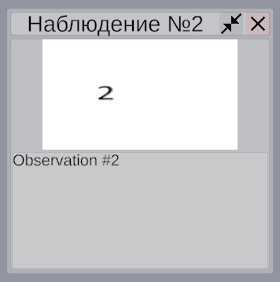

### Работа с Elektronik Tools 2.0 начинается с главного меню

В главном меню Вы можете выбрать один из режимов взаимодействия с Электроником.
1. [Онлайн режим](#Онлайн) - принимается неконтролируемый поток данных. 
   Используется преимущественно для демонстрации данных приходящих в реальном времени.
2. [Оффлайн режим](#Оффлайн) - принимается поток данных который можно останавливать и перематывать. 
   Используется преимущественно для демострации данных записанных в файл.
   
Также вы можете выбрать предпочтительный язык интерфейса.

На данный момент Elektronik использует формат обмена данными
[google protocol buffers](https://developers.google.com/protocol-buffers/?hl=en) и [gRPC](https://grpc.io/).
С документацией по использованию этих фреймворков можно ознакомиться по предоставленным ссылкам.
Ознакомиться с форматом входных данных Вы сможете на [этой странице](Protobuf-RU.md).
Вы можете расширить электроник [плагинами](Plugins-RU.md) для поддержки нужных вам протоколов.

# Настройки

После выбора режима вы попадёте на экран настроек. Здесь вы сможете выбрать какие плагины использовать и указать им настройки,
например выбрать файл для воспроизведения или порт для приёма данных.
Необходимо отметить, что в оффлайн режиме электроник не поддреживает работу с несколькими источниками данных одновременно.
По этому в оффлайн режиме можно выбрать только один плагин предоставляющий источник данных.

1. Возврат в главное меню.
2. Панель плагинов.
3. Преключатель для включения/отключения плагинов.
4. Панель настроек уникальных для каждого плагина.
5. Панель истории настроек для каждого плагина.
6. Сообщения об ошибке запуска плагинов.
7. Запуск воспроизведения.

# Управление проигрывателем

 

1. Вернуться в меню
2. Развернуть окно настроек сцены.

1. Ползунок изменения размера точек
2. Ползунок изменения длительности отображения следа остающегося после перемещения точки.
3. Переключение в VR режим (см. [VR режим](#VR-режим)).
4. Изменить цвет задника сцены.
5. Включить / выключить отображение осей координат.
6. Включить / выключить отображение сетки.
7. Дерево источников данных.
8. Включить / выключить выбранное облако. При выключенном отображении всё равно происходит обновление облаков.
9. Навести камеру на выбранное облако.
10. Включить / выключить следы при перемещении точек.
11. Открыть окно выбранными данными.

# Управление камерой
- Клавиатура:
   - WASD - для перемещения камеры влево/вправо и вперёд/назад
   - QE - для перемещения камеры вверх/вниз
   - Стрелочки - для вращения камеры
   - R - возврат камеры в (0, 0, 0)
- Мышь:
   - При перемещении мыши с зажатой правой кнопкой камера будет вращаться.
   - Колёсико мыши - перемещение вперёд/назад
-  Кнопка "Навести на" для некоторых источников данных 
перемещает камеру так, чтобы выбрвнные данные попадали в кадр.

# Оффлайн

В оффлайн режиме вы можете управлять воспроизведением файла: останавлявать, запуксать, переметывать.

На картинке выше обозначены следующие элементы управления и отображения информации:

1. Запуск / пауза воспроизведения
2. Остановка воспроизведения и возврат в начало
3. Перемотка к предыдущему ключевому кадру
4. Перемотка к следующему ключевому кадру
5. Шкала времени
6. Timestamp (конкретный формат времени зависит от плагина)

# Онлайн

В онлайн режиме электроник позволяет только отображать принимаемые в реальном времени данные.
Для того чтобы очистить все отображаемые объекты вы можете использовать кнопку "Очистка сцены".
Внимание! Если используемый вами плагин обновляет данные в инкрементальном стиле (protobuf), то 
преждевременная очистка может привести к ошибке.

# Наблюдения

Elektronik позволяет увидеть дополнительную информацию о наблюдении, при наведении курсора мыши с помощью высплывающего окна.
При клике по наблюению, данное окно будет закреплено.
Отображение текстовой информации работает в обоих режимах, тогда как изображения только в оффлайн, 
и если была указана директория в которой они хранятся.

# VR-режим

Этот режим сработает, только если у Вас подключен VR шлем и он поддерживается Unity 
(например, если он поддерживается в SteamVR). В VR режиме Вы будете видеть сцену из VR шлема и наблюдать процесс построения карты.

[<- Сборка из исходников](Build-RU.md) | [Внутреннее API ->](API-RU.md)