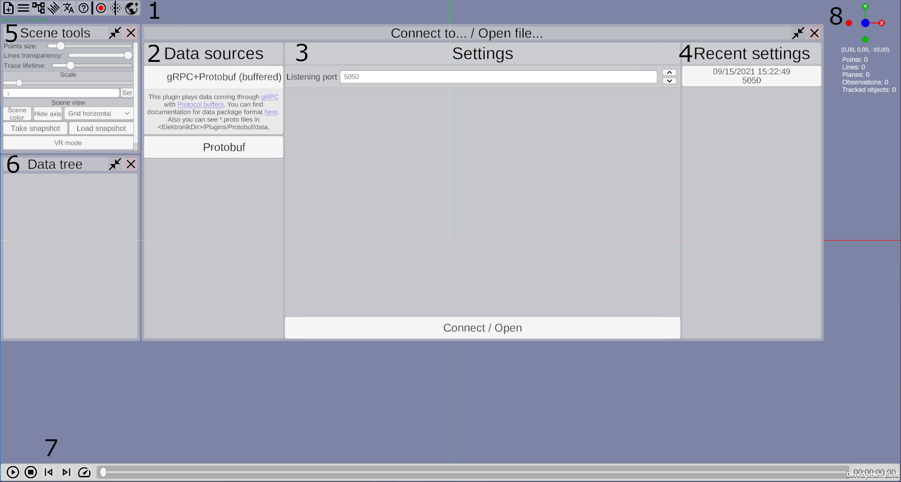
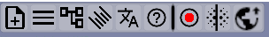
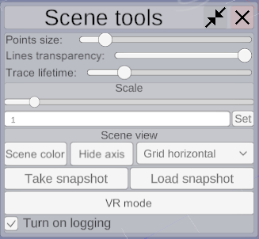
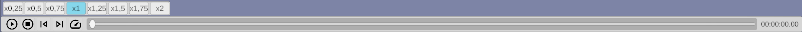

# Работа с Elektronik

### При запуске Электроник встретит вас пустой сценой, окном подключения к источникам данных и элементами управления сценой и воспроизведения.

Основные элементы управления:
1. **Панель инструментов** На ней располагаются кнопки для вызова окон с дополнительными настройками. (Подробнее [далее](#Панель-инструментов)).
2. **Окно подключений -> Список доступных источников данных** Здесь вы можете выбрать откуда брать данные для отображения в Электронике,
например выбрать чтение из файла Protobuf или прослушивание порта по протоколу gRPC (Другие варианты можно добавить [плагинами](Plugins-RU.md)).
3. **Окно подключений -> Настройки подключения** Здесь вы можете указать параметры подключения, например путь к файлу или порт для прослушки.
4. **Окно подключений -> Предыдущие настройки** Здесь перечислены настройки предыдущих подключений для быстрого доступа к ним.
5. **Окно настроек сцены** Здесь перечислены различные элементы управления отображением данных. (Подробнее [далее](#Настройки-сцены)).
6. **Окно "Дерево данных"** Здесь пречислены все отображаемые данные в виде дерева. (Подробнее [далее](#Дерево-данных)).
7. **Панель управления воспроизведением** Вполне стандартная панель управленния воспроизведением, 
позволяет останавливать проигрывание, переметывать на нужную позицию и т.д. (Подробнее [далее](#Управление-воспроизведением)).
8. **Виджет положения камеры** Отображает ориентацию камеры и позволяет выровнять её вдоль осей.

## Панель инструментов

Функции кнопок (слева на право):
- Открыть окно подключений.
- Открыть окно настроек сцены.
- Открыть Дерево данных.
- Открыть окно выбора языка.
- Открыть окно справки.
- *Все кнопки после разделителя добавляются плагинами.* (Далее перечислины плагины входщие в релиз Электроника по умолчанию.)
- Запись состояния сцены в файл.
- Сегментация облака точек различными способами.
- Передача состояния сцены по gRPC/Protobuf.

## Настройки сцены

Это окно позволяет управлять следующими параметрами:
- Отображаемый размер точек
- Прозрачность линий
- Время жизни следа остающегося при перемещении точек. (Если отображение следа включено для контейнера с точками).
- Масштаб сцены.
- Цвет задника сцены.
- Отображение осей.
- Отображение сетки.
- Запись текущего состояния данных. 
- Загрузка снимка данных.
- Переход в VR-режим (только если вы используете сборку поддерживающую VR)
- Включение логирования. При длительной работе Электроника логи могут занимать несколько гигабайт на диске C:/ (/home в линукс), 
по этому в релизной версии эта функция по умолчанию выключена. 

## Дерево данных

Это окно позволяет управлять отображением отдельных контейнеров с данными.

-  Вкл/выкл обтображение данных из контейнера.
-  Навести камеру на контейнер. Для остлеживаемых объектов эта кнопка закрепляет камеру на этом объекте.
-  Открыть окно с содержимым этого контейнера.
-  Вкл/выкл отображение следа при перемещении точек.
-  Для контейнера наблюдений позволяет выбрать минимальное отображаемое ребро графа. 
Т. е. минимальное количество связей между наблюдениями для которых будет отрисовываться линия.
-  Позволяет выбрать цвет меша, либо белый цвет с полигональной сеткой, либо в цвет вершин. 
-  Позволяет сохранить содержимое контейнера в файл.
-  Удаляет контейнер.

## Управление камерой
- Клавиатура:
   - WASD - для перемещения камеры влево/вправо и вперёд/назад
   - QE - для перемещения камеры вверх/вниз
   - Стрелочки - для вращения камеры
   - Backspace - возврат камеры в (0, 0, 0)
- Мышь:
   - При перемещении мыши с зажатой правой кнопкой камера будет вращаться.
   - При нажатии на обе клавиши мыши камерап будет перемещаться вперёд.
   - Колёсико мыши - перемещение вперёд/назад.

## Управление воспроизведением

Вы можете управлять воспроизведением: останавливать, запуксать, переметывать, менять скорость.

На картинке выше обозначены следующие элементы управления и отображения информации (слева направо):

1. Запуск / пауза воспроизведения;
2. Остановка воспроизведения и возврат в начало (для плагинов получающих информацию в онлайн режиме эта кнопка очищает сцену);
3. Перемотка к предыдущему ключевому кадру;
(какие кадры считать ключевыми определяет плагин, если плагин не подоразумевает существования ключевых кадров, то выполняется переход к следующему кадру);
4. Перемотка к следующему ключевому кадру;
5. Управление скоростью воспроизведения;
6. Шкала времени;
7. Timestamp (конкретный формат времени зависит от плагина).

## Горячие клавиши

- F1 - Открыть окно помощи.
- Space - Запуск / пауза воспроизведения.
- Ctrl-Delete - Остановить воспроизведение.
- ю (.) - Переход к следующему кадру.
- б (,) - Переход к предыдущему кадру.
- ъ (]) - Перемотка к следующему ключевому кадру.
- х ([) - Перемотка к предыдущему ключевому кадру.
- Ctrl+N - Открыть окно соединений.
- Ctrl+T - Сделать снимок сцены.
- Ctrl+O - Загрузить снимок сцены.
- Ctrl+F - Открыть окно записи / остановить запись.
- Ctrl+Y - Открыть окно настроек сцены.
- Ctrl+U - Открыть окно кластеризации облаков точек.
- Ctrl+G - Вкл/выкл отображение сетки.
- Ctrl+H - Вкл/выкл отображение осей.
- Ctrl+M - Переключение цвета мешей (либо белый цвет с полигональной сеткой, либо в цвет вершин).
- F2 - Переход в VR режим.
- F3 - Открыть окно помощи в VR режиме.

## Наблюдения

При наведении курсора мыши на наблюдение появится окно с изображением с камеры во время съемки наблюдения и сообщеним прикреплённым к этому наблюдению. 
При клике по наблюению, данное окно будет закреплено.
Также в заголовке окна вы можете увмдеть кнопки, которые позволят перейти к предыдущему/следующему наблюдению и навести камеру на наблюдение.

## VR-режим

Этот режим сработает, только если у Вас подключен VR шлем, он поддерживается Unity (например, если он поддерживается в SteamVR) 
и вы используете сборку Электроника с поддержкой Vr.В VR режиме Вы будете видеть сцену из VR шлема и наблюдать процесс построения карты.

[<- Сборка из исходников](Build-RU.md) | [Внутреннее API ->](API-RU.md)