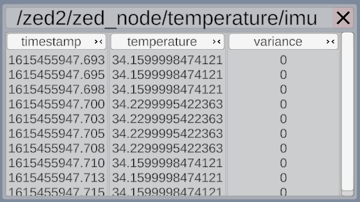
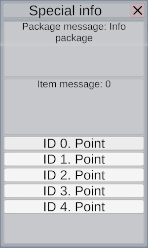

# Windows for additional data

Elektronik has built-in windows system. That allows to show user any kind of data,
not only clouds of objects. For example it can be text data or tables or images.

## Types of windows

### Text window

- Has 2 modes:
  - 1 message (Next message will replace previous)
  - List of messages (Next messages will be added to the end) 
    *Due to limitation of Unity text renderer it can only show 10 last messages*
    
### Table window

*Due to limitation of Unity text renderer adding of new row in table is very slow operation.
So, this type of windows shows only 10 last rows of table. Or you can preload all data.*

### Image window

### Observation window (image + text)

### Special info window (protobuf)

[<- Write your own plugin](Plugins-EN.md) | [Protobuf plugin ->](Protobuf-EN.md)