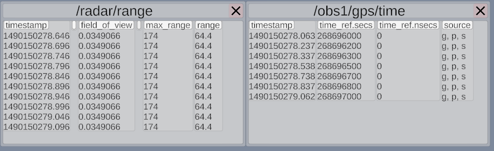
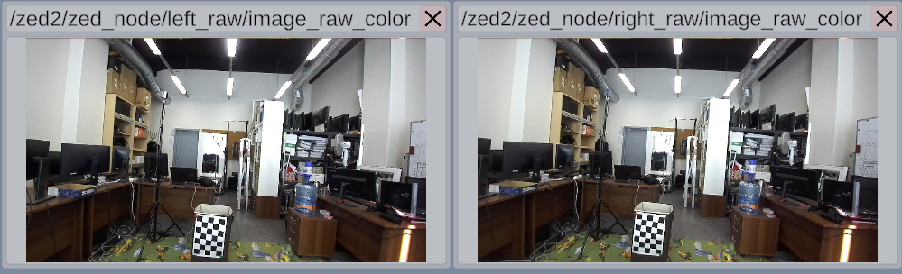
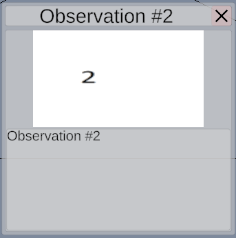
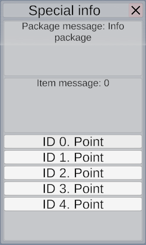
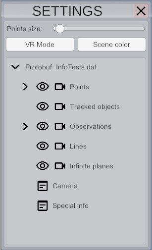

# Окна для вывода дополнительных данных.

Электроник имеет систему окон, которые позволяют выводить пользователю любые данные,
не ограничиваясь лишь облаками объектов. Например, текстовые данные или табличные.

## Виды окон

### Окно вывода текста

- Имеет 2 режима работы:
  - Вывод 1 сообщения (Следующее сообщение заменит предыдущее)
  - Вывод списка сообщений (из-за особенностей работы unity с текстом выводятся только последние 10 сообщений)
  
### Окно вывода таблиц

*Из-за особенностей работы unity с текстом добавление очередной строки в таблицу - медленная операция, 
по этому по умолчанию выводятся последние 10 строк таблицы. Либо можно загрузить все данные сразу.*

### Окно вывода изображений

### Окно вывода информации о наблюдении (изображение + текст)

### Окно вывода специальной информации (protobuf)

### Окно настроек

[<- Написать свой плагин](Plugins-RU.md) | [Protobuf plugin ->](Protobuf-RU.md)